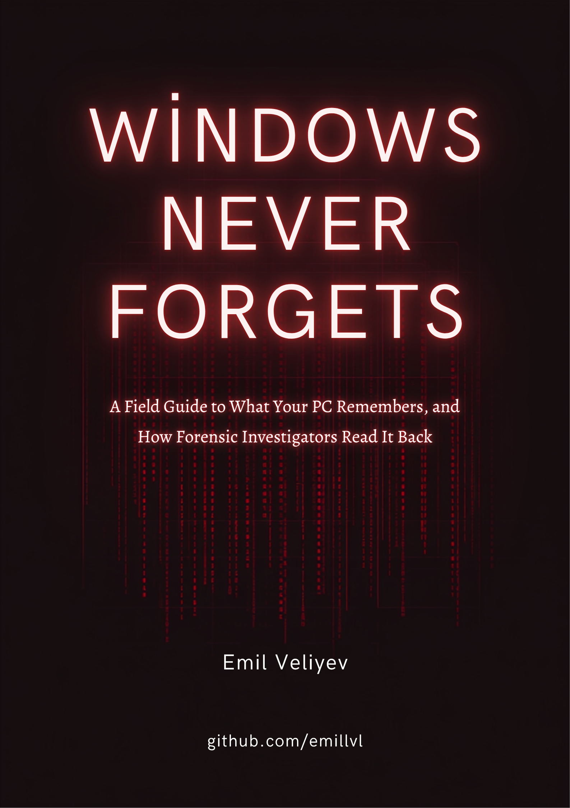

# Windows Never Forgets

### A field guide to what your PC remembers, and how forensic investigators read it back

---

## What this is

Every modern version of Windows keeps a diary. Nobody sits down and writes it on purpose. It builds up on its own, a byproduct of hundreds of small subsystems doing their jobs: a service checking whether the last update installed cleanly, a shell feature remembering your recent files, a diagnostics pipeline reporting which drivers are crashing. None of it was designed as surveillance. Almost all of it was designed to make the operating system faster, more reliable, or more convenient. The side effect, added up across the whole system, is a machine that remembers far more than most people realize.

This book is a full tour of that diary: the background services that never sleep, the registry keys and cache files that log what you clicked, the kernel-level hooks and ETW tracing that make it all possible, and the network endpoints everything eventually reports to. It covers telemetry, digital forensics, and Windows internals as one connected subject, because on Windows they turn out to be the same territory viewed from different angles.

It does not assume prior field expertise, and it does not round anything off. Every registry key, file path, event ID, and binary structure covered in the source research is explained in plain language, in full, in order.

## Who it's for

Anyone who wants to understand what Windows actually does in the background: DFIR practitioners and incident responders, security researchers, sysadmins hardening a fleet, developers building on Windows internals, or anyone curious what their own PC has been quietly writing down.

## Read it

- **[Windows Never Forgets.pdf](<Windows Never Forgets.pdf>)** — the full typeset book, cover included.
The book is currently available as a PDF. The contents below describe its sections; separate Markdown chapters are not included in this repository.

## Contents

| Part | Chapters |
|---|---|
| Front matter | Preface and a short glossary of recurring terms |
| Part one: the watchers | 1. The telemetry and diagnostics machinery &middot; 2. Identity, location, and the cloud tether &middot; 3. Network, security, and shell services |
| Part two: what you ran | 4. Prefetch, ShimCache, and Amcache &middot; 5. SRUM &middot; 6. BAM and DAM &middot; 7. Windows Recall |
| Part three: what you clicked | 8. UserAssist &middot; 9. The MRU universe &middot; 10. Shellbags &middot; 11. LNK files and jump lists |
| Part four: the file system itself | 12. The master file table &middot; 13. $LogFile, $UsnJrnl, and $Recycle.Bin |
| Part five: what the system saw | 14. Event logs &middot; 15. WER, minidumps, and kernel dumps &middot; 16. PSR, boot/shutdown, hibernation, and the page file |
| Part six: the shell remembers | 17. Thumbnails and the search index &middot; 18. Timeline &middot; 19. Edge's local footprint &middot; 20. Notifications, Cortana, IE cache, maps, clipboard, sticky notes |
| Part seven: under the hood | 21. Kernel process/thread/image hooks &middot; 22. Registry, object, and minifilter callbacks &middot; 23. ETW explained &middot; 24. Autologgers and providers |
| Part eight: the scheduler's secrets | 25. The scheduled tasks Windows runs without asking &middot; 26. How the Task Scheduler keeps score |
| Part nine: the network and the cloud | 27–32. The telemetry pipeline, Windows Update, OneDrive and CDP, push/SmartScreen/MAPS, Wi-Fi and credentials, Xbox/Edge/Store, and the full endpoint list |
| Part ten: persistence and the early boot | 33. BITS, BootExecute, MountedDevices, autostart locations, VSS &middot; 34. WMI persistence |
| Part eleven: scripts, audits, and what gets logged | 35. PowerShell logging &middot; 36. DNS cache, security auditing, AppLocker |
| Part twelve: credentials, identity, and Defender | 37. Windows Hello and DPAPI &middot; 38. Defender, certificates, and the firewall log |
| Part thirteen: the last mile | 39. Installer footprints, services registry, Group Policy &middot; 40. The EVTX format itself |
| Part fourteen: making sense of it all | 41. Tools of the trade &middot; 42. Timestamp formats &middot; 43. Anti-forensics &middot; 44. The privacy control registry |

## Scope

Windows 10 (roughly 20H2 through 22H2), Windows 11 (21H2 through 24H2, including Recall on Copilot+ PCs), and Windows Server 2016 through 2022 where server behavior differs. Where a detail is version-dependent, the book says so.

## License

Text and cover art are released under [CC BY 4.0](https://creativecommons.org/licenses/by/4.0/): share it, adapt it, translate it, just credit the author.

## Author

**Emil Veliyev**
[github.com/emillvl](https://github.com/emillvl)
