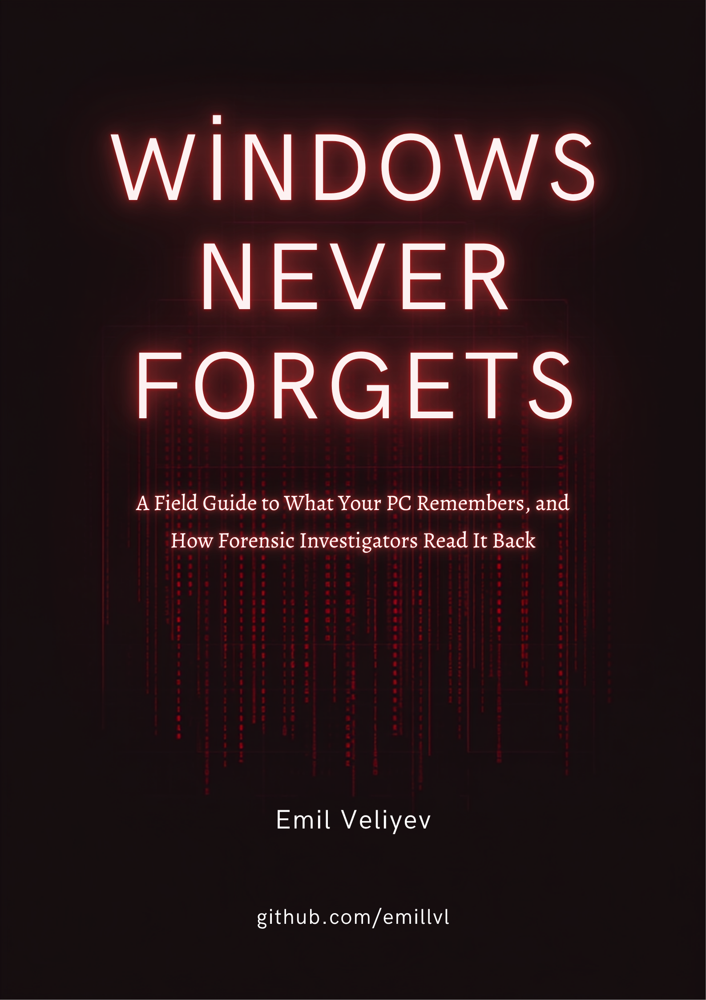

# Windows Never Forgets

### A field guide to what your PC remembers, and how forensic investigators read it back

---

## What this is

Windows records activity as its services and applications run. Updates leave diagnostic records, the shell remembers recent files, and crash reporting records driver failures. These features support reliability, performance, and convenience, but their records can also reveal how someone used a computer.

This book examines those records alongside the systems that create them: background services, registry keys, caches, kernel hooks, ETW tracing, and network reporting endpoints. It connects Windows internals with telemetry and digital forensics.

You do not need prior experience in the field. The book explains the registry keys, file paths, event IDs, and binary structures covered in its source research in plain language.

## Who it's for

The book is for DFIR practitioners, incident responders, security researchers, system administrators, and developers working with Windows internals. It is also for readers who want to understand what their own PC records.

## Read it

- **[Windows Never Forgets.pdf](<Windows Never Forgets.pdf>)**: the full typeset book, cover included.

The book is currently available as a PDF. The contents below describe its sections; separate Markdown chapters are not included in this repository.

## Contents

| Part | Chapters |
|---|---|
| Front matter | Preface and a short glossary of recurring terms |
| Part one: the watchers | 1. The telemetry and diagnostics machinery &middot; 2. Identity, location, and the cloud tether &middot; 3. Network, security, and shell services |
| Part two: what you ran | 4. Prefetch, ShimCache, and Amcache &middot; 5. SRUM &middot; 6. BAM and DAM &middot; 7. Windows Recall |
| Part three: what you clicked | 8. UserAssist &middot; 9. The MRU universe &middot; 10. Shellbags &middot; 11. LNK files and jump lists |
| Part four: the file system itself | 12. The master file table &middot; 13. $LogFile, $UsnJrnl, and $Recycle.Bin |
| Part five: what the system saw | 14. Event logs &middot; 15. WER, minidumps, and kernel dumps &middot; 16. PSR, boot/shutdown, hibernation, and the page file |
| Part six: the shell remembers | 17. Thumbnails and the search index &middot; 18. Timeline &middot; 19. Edge's local footprint &middot; 20. Notifications, Cortana, IE cache, maps, clipboard, sticky notes |
| Part seven: under the hood | 21. Kernel process/thread/image hooks &middot; 22. Registry, object, and minifilter callbacks &middot; 23. ETW explained &middot; 24. Autologgers and providers |
| Part eight: the scheduler's secrets | 25. The scheduled tasks Windows runs without asking &middot; 26. How the Task Scheduler keeps score |
| Part nine: the network and the cloud | 27-32. The telemetry pipeline, Windows Update, OneDrive and CDP, push/SmartScreen/MAPS, Wi-Fi and credentials, Xbox/Edge/Store, and the full endpoint list |
| Part ten: persistence and the early boot | 33. BITS, BootExecute, MountedDevices, autostart locations, VSS &middot; 34. WMI persistence |
| Part eleven: scripts, audits, and what gets logged | 35. PowerShell logging &middot; 36. DNS cache, security auditing, AppLocker |
| Part twelve: credentials, identity, and Defender | 37. Windows Hello and DPAPI &middot; 38. Defender, certificates, and the firewall log |
| Part thirteen: the last mile | 39. Installer footprints, services registry, Group Policy &middot; 40. The EVTX format itself |
| Part fourteen: making sense of it all | 41. Tools of the trade &middot; 42. Timestamp formats &middot; 43. Anti-forensics &middot; 44. The privacy control registry |

## Scope

Windows 10 (roughly 20H2 through 22H2), Windows 11 (21H2 through 24H2, including Recall on Copilot+ PCs), and Windows Server 2016 through 2022 where server behavior differs. Where a detail is version-dependent, the book says so.

## License

Text and cover art are released under [CC BY 4.0](https://creativecommons.org/licenses/by/4.0/): share it, adapt it, translate it, just credit the author.

## Author

**Emil Veliyev**
[github.com/emillvl](https://github.com/emillvl)
